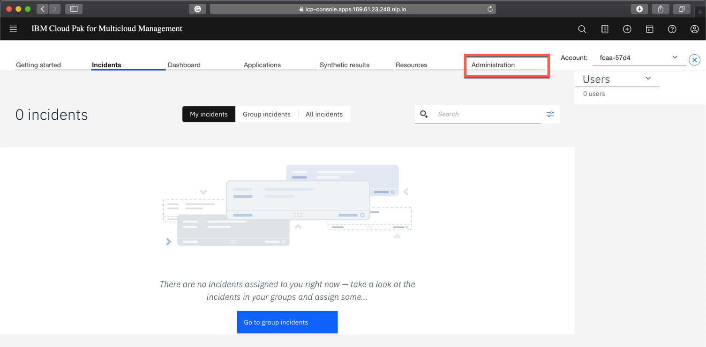
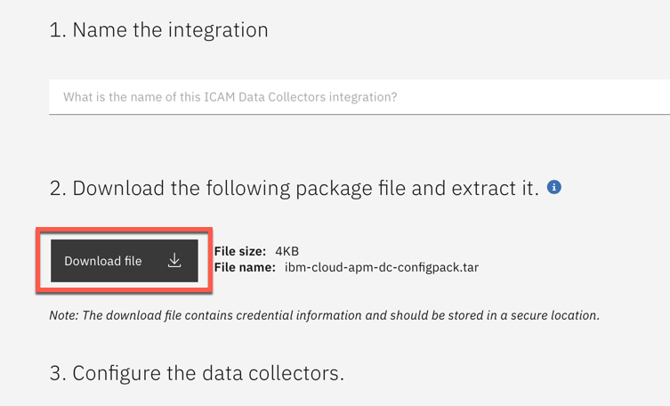

# Exercise 2 Install k8s monitor to the managed cluster

## Gather config-pak for your tenant

1. In the browser window where you are logged in to IBM Cloud Pak for Multicloud Management open top-left menu and select **Monitor health** and **Incidents**


2. When the IBM Cloud App Management Incident view opens, click the **Administration** tab



3. Click the **Integration** tile


4. In the Integrations view click **New integration**


5. Click **Configure** under the **ICAM Data Collectors** tile


6. Do not provide any name, just click the **Download file** button and save the file to your workstation



7. Copy the config file to the managed cluster (Remember to change the port number to one matching your environment instance)
```
scp -P <port> ibm-cloud-apm-dc-configpack.tar  localuser@services-uscentral.skytap.com:/home/localuser/install/app_mgmt_k8sdc
```

8. In the terminal window where you are logged in to managed cluster run the following commands, adjusting the **cluster_name** value
<pre>
cd install/app_mgmt_k8sdc
ansible-playbook helm-main.yaml --extra-vars="<b>cluster_name=user1</b> release_name=icam-kubernetes-resources \
docker_registry=edge-server.demo:8500 namespace=default docker_group=default tls_enabled=true"
</pre>

Ansible playbook should finish with the following line
```
PLAY RECAP ****************************************************************************************************************************
127.0.0.1                  : ok=15   changed=8    unreachable=0    failed=0    skipped=2    rescued=0    ignored=0   
```

9. Verify that the K8Monitor is running
```
localuser@edge-server:~/install/app_mgmt_k8sdc$ kubectl get pod -n default
NAME                                                   READY   STATUS    RESTARTS   AGE
icam-kubernetes-resources-k8monitor-54876594c5-9xvzs   2/2     Running   0          48s
```

10. Go back to the browser with the IBM Cloud App Management UI. Click the **Resources** tab


You should see the several Kuberenetes resources. Feel free to explore what data is shown for different resource types. This consludes this exercise
