# Exercise 12 Exploring the Golden Signals

[Go back to the Table of Contents](../../README.md)

During this lab exercise, you will be exploring the Golden Signals.  The Golden Signals are a way of normalizing the performance KPIs to make it easier and more intuitive for an SRE to debug a problem.

## Exploring the Golden Signals

### 1. In the browser with the IBM Cloud App Management UI, click the Resources tab

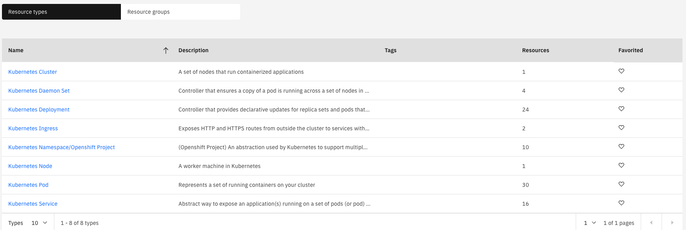

### 2. Select "Kubernetes Services"

You will see a list of kubernetes services that are running in your environment

### 3. Click the link for the "productpage" resource

You will navigate to the page for the productpage microservice.  Let's explore this page as seen below

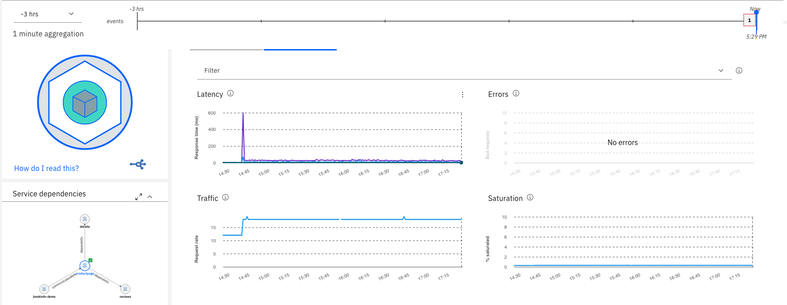

### 4. Deployment topology

In the upper left corner, you see the "Deployment topology".  You've seen this before in the context of the kubernetes cluster.  Now, you're viewing it in the context of the productpage microservice.  What the topology is showing you is that this microservice is deployed to one pod on one node in the cluster.  If you scaled out the deployment to 2 pods, then you would see 2 pods in the Deployment topology.

### 5. Golden Signals

Next, look at the golden signals on the right side of the page.   The 4 graphs labeled Latency, Errors, Traffic, and Saturation are the Golden Signals.  These are the most important metrics for Site Reliability Engineering (SRE) as they show the metrics imoprtant from the end-user perspective, that have been normalized for different application/middleware domains.  Let's explore Latency a little more.

### 6. Latency

Flyover the Latency Graph.  You'll see a graph showing the latency shown in different percentiles (50th, 90th, and 95th).  By using percentiles, you get a much better idea how the applicaiton is performing.

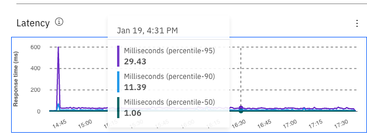

Next, select the dropdown list in the Filter.  The default behavior is to show 50th, 90th, and 95th percentile for all URLs.  But, sometimes you want to filter the data.  

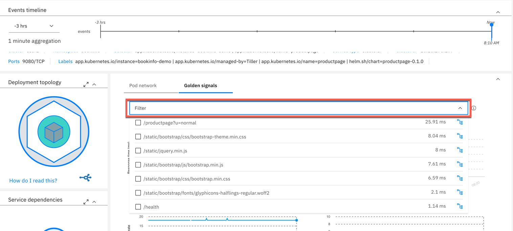

#### Select 1 or more of the URLs for the productpage microservice

View the latency data for the URLs that you selected.

#### Within filters, select the icon on the far right for the "/productpage?u=normal" URL.

After you click the icon, you will see some very useful information as seen below.  At the top of the page, you see a scatter plot chart that allows you to see a distribution of the requests.  This is a very useful way to visualize the transactions because it allows you to see patterns and outliers.  

Below that, expand one of the requests and you will see a breakdown of where the request spent its time.

Close the Trace Breakdown window by clicking the "X" in the upper right corner.

#### Now, click the 3 vertical dots in the upper right corner of the Latency graph and select "Latency Options"

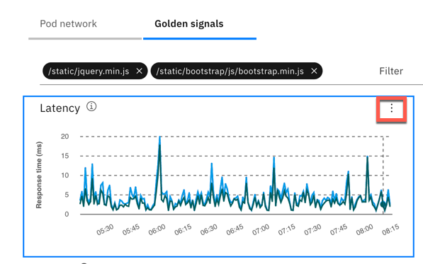

Notice that you can customize the latency options.  Either change the latency percentiles or add/delete lines from the graph.  Try it out.

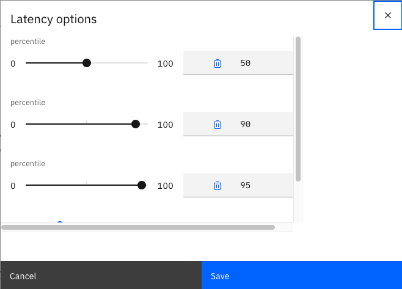

### 7. Next, examine the Service dependencies

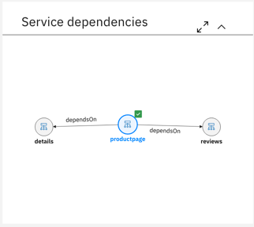

The service dependency shows a 1-hop topology of the microservices.  For the productpage service, it shows that there are clients connecting to the service and there is a dependency on "details" and "reviews".  

Click on "reviews" icon.  You will navigate to that microservice and see the 1-hop topology for the "review" service.  Examine the golden signals for the "reviews" service.  

### 8. Full Service Topology

Most of the time, the 1-hop topology is good enough to diagnose the root cause of a problem.  But, sometimes you need to see additional information.  Click the **"expand to the full screen"** icon in the upper right corner of the service dependencies to expand the view.

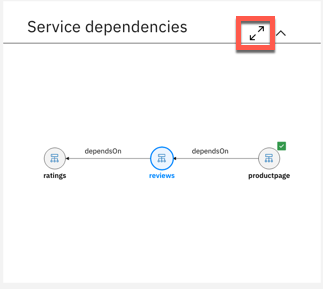

The view you see comes from an embedded capability called Agile Service Manager (ASM).  ASM allows you to expand to more than hop in the topology. It also allows you to visualize changes that are occurring in the application.  Since change introduces most of the problems in IT, this is a powerful capability.

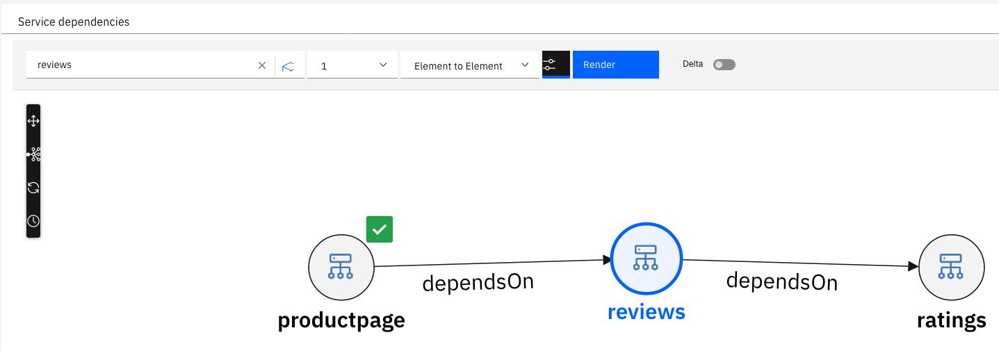

Let's start by switching to a 2-hop topology.  Select the dropdown in the top-middle of the screen and change the value to "2".  Then click "Render"

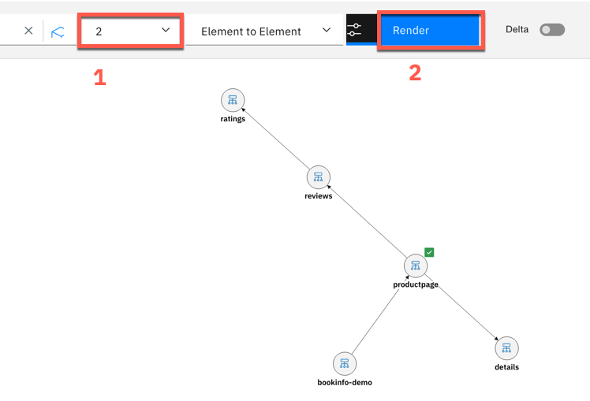

*EXPLANATION: Your view might be slightly different (without a bookinfo-demo icon). This icon represents the ingress and your managed cluster does not have ingress installed so this resource doesn't show up*

We won't examine it here, but ASM allows you to hide/show some additional objects in the topology.  In this topology, you see the microservice topology.  If you want, you can add the pods into the topology.  To add/hide elements on the page, click the **Filter** icon to the left of the "Render" button.

ASM has powerful capabilities to show you what's changing.  This includes topology changes, state changes, and property changes.  We won't be exploring that capability since there haven't been any changes to the application.  Feel free to explore additional ASM capabilities.  When you are done exploring, you can click on one of the icons for the microservices and you will navigate back to the Golden Signal view.

### 9. Drill Down into the Runtime

Sometimes you need additional details that can only be gathered from the data collector that is running within the runtime.  If the app server (python, Node.js, JVM, golang) is instrumented with a lightweight data collector, you can click on the container and drilldown into the runtime metrics.  

Click on the "container" in the Deployment topology.

You are now viewing the detailed container metrics for this microservice. To navigate to the detailed metrics reported by the data collector, scroll down and click the appropriate name in **Related resources** window.

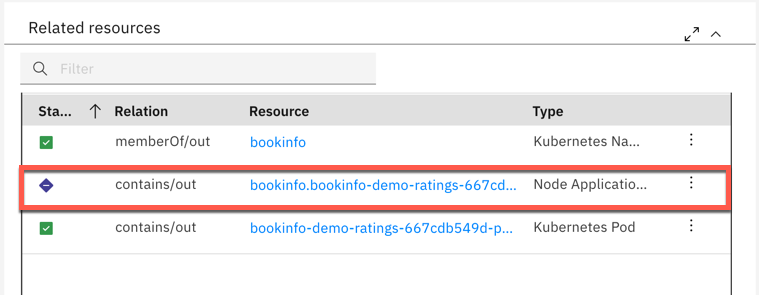

The runtime page shows selection of most important metrics for a selected runtime type

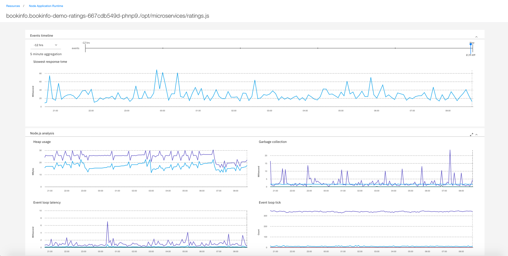

To expore any other metric, scroll down the page and expand the **Custom metrics** section, picking the metric you want and additional filtering and display options.

This concludes the exercise. You now understand who to naviagate Golden Signals view.

Additional resources: 
- [Golden Signals video on YouTube](https://youtu.be/z5WLD6vANvw)
- [Blog: Golden Signals explained](https://www.ibm.com/cloud/blog/video-better-application-monitoring-with-sre-golden-signals)

[Go back to the Table of Contents](../../README.md)

<table>
  <tr>
    <td>Version</td>
    <td>1.0</td>
  </tr>
  <tr>
    <td>Authors</td>
    <td>Ben Stern, IBM Wlodek Dymaczewski, IBM</td>
  </tr>
  <tr>
    <td>email</td>
    <td>bstern@us.ibm.com dymaczewski@pl.ibm.com </td>
  </tr>
</table>