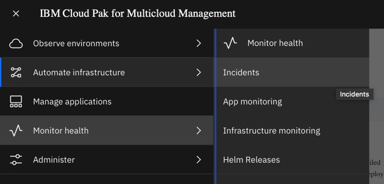
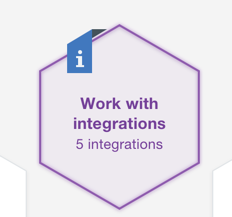
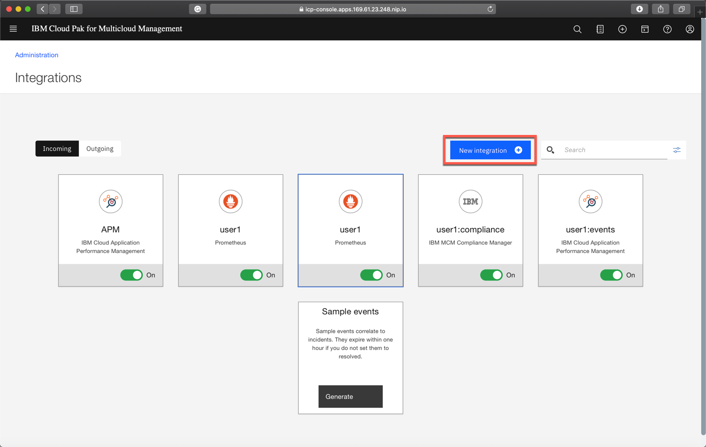
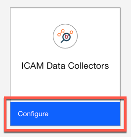

# Exercise 2 Install k8s monitor to the managed cluster

[Go back to the Table of Contents](../../README.md)

In this exercise, you will be instrumenting your managed cluster with the kubernetes data collector (k8monitor).  The kubernetes data collector will provide detailed monitoring about the performance and health of the entire kubernetes cluster including the nodes, pods, containers, ingress, and more.

## Gather config-pak for your tenant

### 1. In the browser window where you are logged in to IBM Cloud Pak for Multicloud Management open top-left menu and select **Monitor health** > **Incidents**



### 2. When the IBM Cloud App Management Incident view opens, click the **Administration** tab


### 3. Click the **Integration** tile



### 4. In the Integrations view click **New integration**



### 5. Click **Configure** under the **ICAM Data Collectors** tile



### 6. Do not provide any name, just click the **Download file** button and save the file to your workstation


### 7. Copy the config file to the managed cluster (Remember to change the port number to one matching your environment instance)

Kubernetes data collector media has already been extracted to /home/localuser/install/app_mgmt_k8sdc.  In this step, you are going to copy the configpack into the same directory as the kubernetes data collector. If you have a Windows workstation, you can also use your favorite SCP tool like Filezilla or WinSCP.

```
scp -P <port> ibm-cloud-apm-dc-configpack.tar  localuser@services-uscentral.skytap.com:/home/localuser/install/app_mgmt_k8sdc
```

### 8. In the terminal window where you are connected to managed cluster run the following commands, adjusting the **cluster_name** value
   
**ATTENTION: Remember to change the cluster_name in the command!**   

*HINT: If you are using Windows, first copy the lines to Notepad, edit the username and then copy/paste to Putty window*

<pre>
cd /home/localuser/install/app_mgmt_k8sdc
ansible-playbook helm-main.yaml --extra-vars="<b>cluster_name=user1</b> release_name=icam-kubernetes-resources \
docker_registry=edge-server.demo:8500 namespace=default docker_group=default tls_enabled=true"
</pre>

Ansible playbook should finish with the following line
```
PLAY RECAP ****************************************************************************************************************************
127.0.0.1                  : ok=15   changed=8    unreachable=0    failed=0    skipped=2    rescued=0    ignored=0   
```

You have now completed the installation of the kubernetes data collector

If the Ansible playbook failed, read the instructions for step 8 again. Run the script ```/home/localuser/scripts/uninstall-k8smonitor.sh```. Then, correct the command and run it again.

### 9. Verify that the K8Monitor is running
```
localuser@edge-server:~/install/app_mgmt_k8sdc$ kubectl get pod -n default
NAME                                                   READY   STATUS    RESTARTS   AGE
icam-kubernetes-resources-k8monitor-54876594c5-9xvzs   2/2     Running   0          48s
```

This concludes the exercise. Your managed cluster has now the Kubernetes data collector deployed and reports data back to the IBM CLoud App Management server. In the next exercise you will explore what data is monitored for different resource types. 

[Go back to the Table of Contents](../../README.md)

<table>
  <tr>
    <td>Version</td>
    <td>1.0</td>
  </tr>
  <tr>
    <td>Author</td>
    <td>Wlodek Dymaczewski, IBM</td>
  </tr>
  <tr>
    <td>email</td>
    <td>dymaczewski@pl.ibm.com</td>
  </tr>
</table>