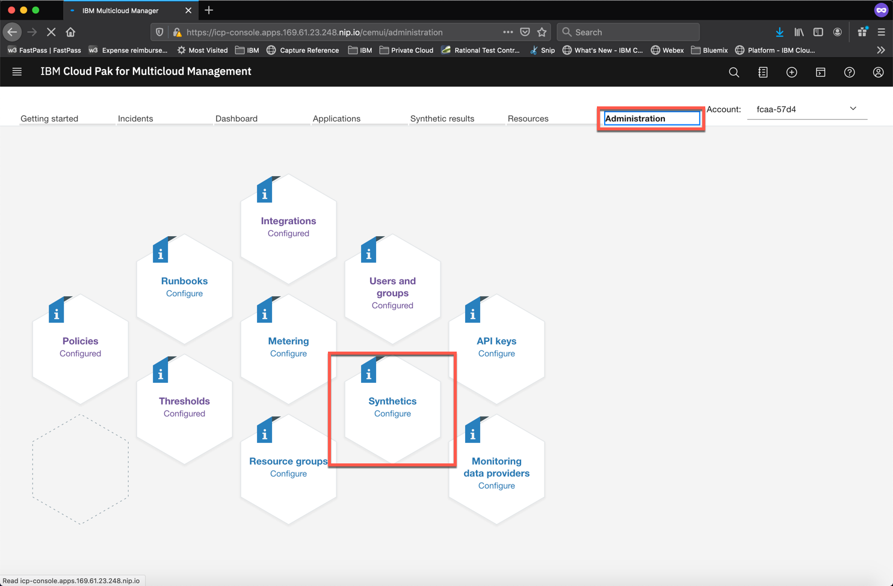
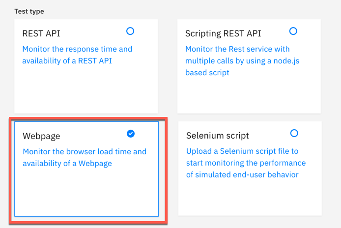
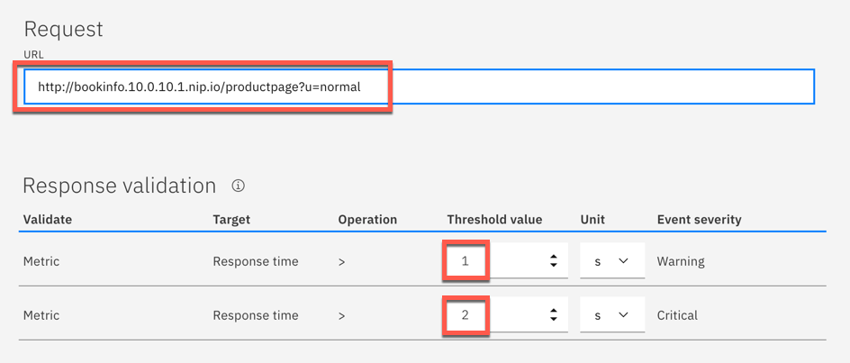
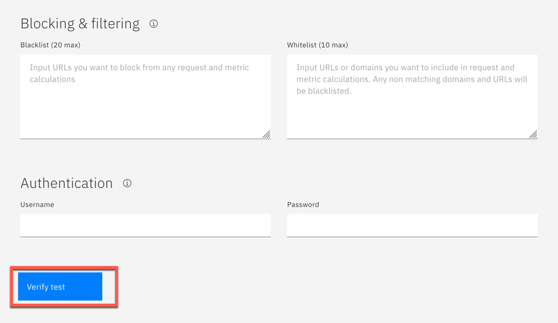
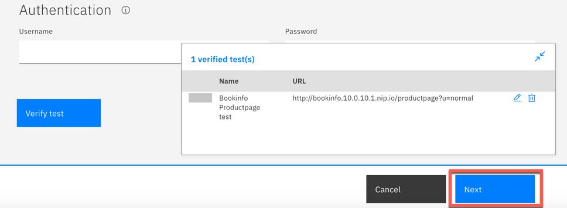
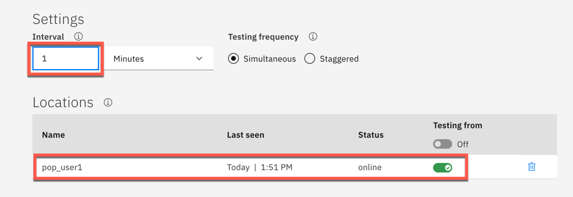
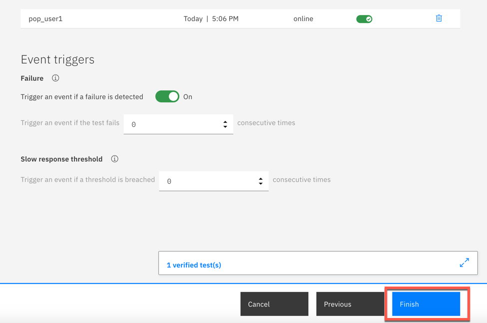
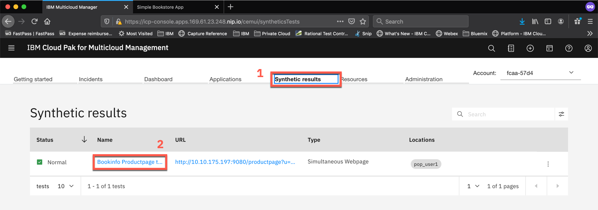
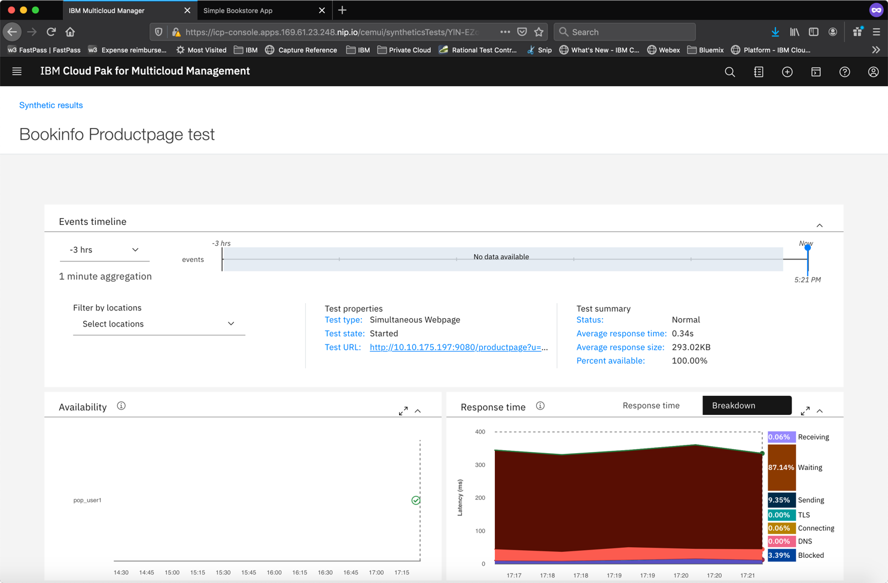

# Exercisae 4 Installing and configuring a Synthetics PoP

Knowledge center reference: https://www.ibm.com/support/knowledgecenter/en/SS8G7U_19.4.0/com.ibm.app.mgmt.doc/content/dc_synthetics_intro.html?cp=SSFC4F_1.2.0

### 1. In the terminal window, where you are logged in to the managed cluster, run the following commands:

```
cd /home/localuser/install/app_mgmt_syntheticpop_xlinux
./precheck.sh
./config-pop.sh -f ../app_mgmt_k8sdc/ibm-cloud-apm-dc-configpack.tar
```

Answer the installation wizard with the following values:
<pre>
You will configure a new local point of presence (PoP).

Enter a name for your PoP. Your PoP will be identified by this name: <b>pop_user1</b> <-- Use your user id
The PoP name is set to pop_user1


Enter the name of the country in which your PoP is located: Austria
The country name is set to Austria


Enter the name of the city in which your PoP is located: Vienna
The city name is set to Vienna


Enter a description of your PoP (optional): FS20pop
The description is set to "FS20pop"


Enter the proxy server address for communicating with IBM ICAM server. The address format is ip:port (Press Enter if you do not need to use a proxy) :  
Proxy server address for communicating with IBM ICAM server is set to 


Update the proxy type (no | manual | pac) for playbacking synthetic tests to monitor your web applications. Enter 'no' to choose no proxy. Enter 'manual' to configure your proxy with a proxy server ip address and port number. Enter 'pac' to use an automatic configuration URL. (Press Enter if you do not want to make any changes: no): 
Playback proxy type is set to no


Your PoP is configured with the following details:
LOCATION="pop_user1,Austria,Vienna,0,0,FS20pop"
AGENT_PROXY_SERVER=""
PLAYBACK_PROXY_TYPE="no"
PLAYBACK_PROXY_HOST_PORT=""
PLAYBACK_PROXY_BYPASS=""
PLAYBACK_PROXY_CONFIG_URL=""
CACHE_REDIS_MAX_SIZE_MB=""

Do you confirm? [y for yes or n for no]: y
pop.properties is configured! You can run start-pop.sh to start your PoP.
</pre>

### 2. Start the Synthetics PoP agent
   
```
./start-pop.sh
```

### 3. In the IBM Cloud App Management User Interface go to the **Administration** tab and select the **Synthetics** tile



### 4. Click **Create** button


### 5. Give your test a name


### 6. Scroll down and select the test type (Webpage)



### 7. In the next step you need to provide the tested application URL. As the managed cluster you use in the lab is really lightweight it does not have the ingress installed. For testing you will use Cluster IP. To find out the ClusterIP run the following command:

```
kubectl get svc -n bookinfo |grep productpage |awk '{print "http://" $3 ":9080/productpage?u=normal"}'
```
   
### 8. Scroll down and provide the following values:

    URL: http://10.10.175.197:9080/productpage?u=normal   <--- Make sure you use the URL from above step

    Threshold value for Warning: 1

    Threshold value for Critical: 2



### 9. Click **Verify test**



The test will timeout as your browser don't have access to that page. Ignore the pop-up dialog and click **Next**



### 10. On the next page, change the test frequency to 1 minute and make sure that your previously installed PoP agent is selected



### 11. Click **Finish** at the bottom of the page



### 12. Go back to the **Administration** page and then click **Synthetic results** tab and the test name



### 13. Verify that the Bookinfo application is running 



This concludes the exercise.

[Go back to the Table of Content](../Exercise0/README.md)

<table>
  <tr>
    <td>Version</td>
    <td>1.0</td>
  </tr>
  <tr>
    <td>Author</td>
    <td>Wlodek Dymaczewski, IBM</td>
  </tr>
  <tr>
    <td>email</td>
    <td>dymaczewski@pl.ibm.com</td>
  </tr>
</table>