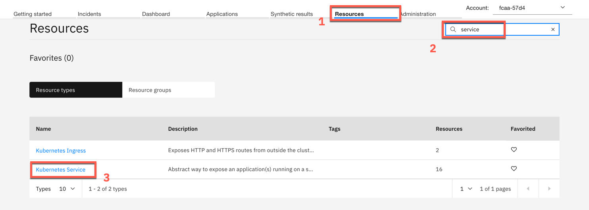
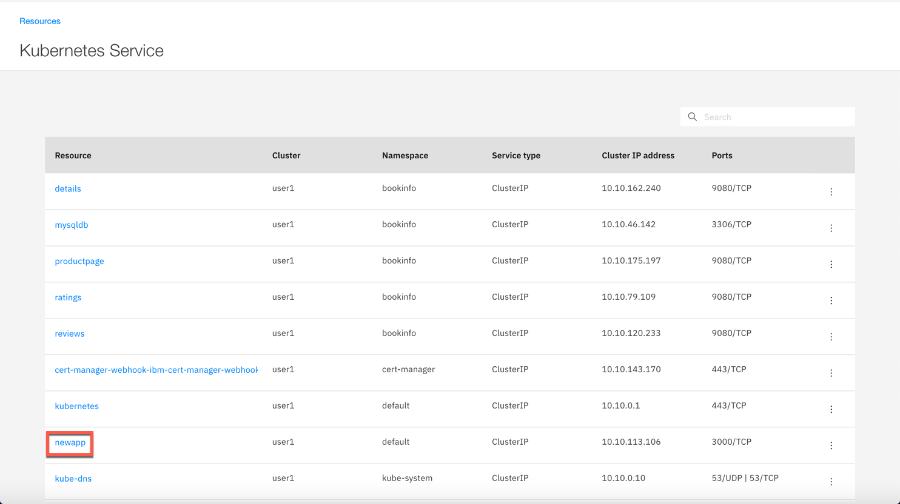
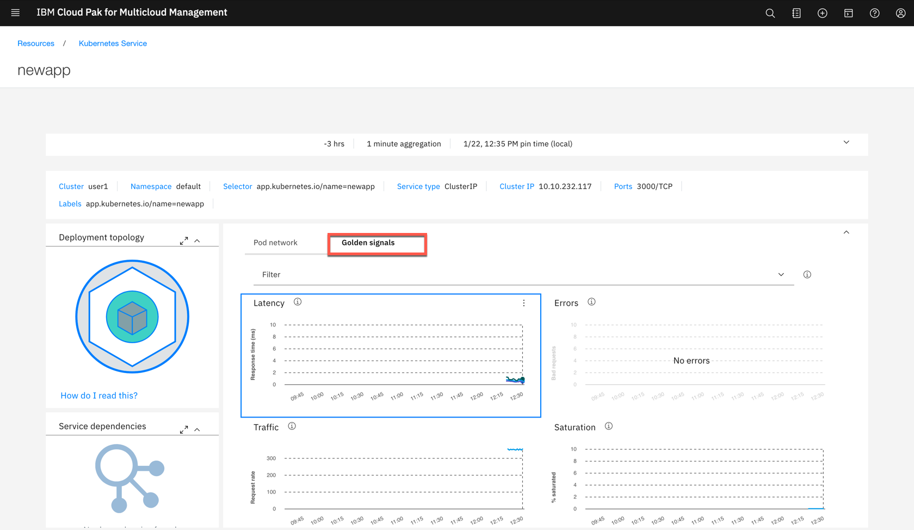

# Instrumenting a new microservice using Appsody

[Go back to the Table of Contents](../../README.md)

## Installing the Appsody 

Normally you install Appsody on the development environment - typically your local workstation. However for the course of this lab you will use the managed cluster to install and run Appsody (More dedicated Appsody and Kabanero labs are planned in other sessions)

The purpose of this exercise it to demonstrate that the Appsody stacks by default include the monitoring instrumentation for selected runtimes. You will also learn how to connect the genereated microservices to the IBM Cloud App Management server.

### 1. Install the Appsody on the managed cluster

Appsody binaries have been downloaded for you and are located in /home/localuser/install directory. Run the following commands to install Appsody:
```
cd /home/localuser/install
sudo apt-get install -y ./appsody_0.5.4_amd64.deb
```

### 2. Adding customized stack repo and generating a new microservice

Appsody stacks may or may not be instrumented with the latest data collectors. In order to have a full control over the stacks used in your organization, you may create your own versions of the public stacks, accomodating any changes that your organization may need. As an example we have created a custom copy of nodejs-express stack and added the latest data collector to it.

Add the `fs20` repo containing this customized stack to your local Appsody environment

```
appsody repo add fs20 https://raw.githubusercontent.com/dymaczew/stacks/master/incubator/fs20-index.yaml
```

In order to generate a new Node.js microservice create a new directory and run the appsody init there.

```
cd
mkdir newapp
cd newapp
appsody init fs20/fs20-nodejs-express
```

### 3. Building and deploying the microservice to the managed cluster

You can review the sample application app.js. It is very simple - there is nothing special in the JavaScript code. The runtime instrumentation is embedded the template, which you can review here: [https://github.com/dymaczew/stacks](https://github.com/dymaczew/stacks) 

To build the application run the following command
```
appsody build
```
You can verify that container was build successfully running the following command
```
docker images |grep newapp
```

Output should show recently build docker image
```
dev.local/newapp                                                   latest              c98cbb4ee3bb        8 minutes ago       177MB
```

You will deploy the microservice to the *default* namespace. To instruct the monitoring data collector embedded in the microservice where to send the data, you need to create a secret with ICAM server configuration, similarly to the Step 2 in [Installing Bookinfo app to a managed cluster](../Exercise3/README.md). The only difference is that you will use *default* namespace instead on *bookinfo*

The configpak files should be there if you completed the steps in previous exercises. If not, follow the steps in tutorial [Install k8s monitor to the managed cluster](../Exercise2/README.md).

To create the *icam-server-secret* run the following commands:

```
LOCALDIR=`pwd`
cd /home/localuser/install/app_mgmt_k8sdc/ibm-cloud-apm-dc-configpack
kubectl -n default create secret generic icam-server-secret \
--from-file=keyfiles/keyfile.jks \
--from-file=keyfiles/keyfile.p12 \
--from-file=keyfiles/keyfile.kdb \
--from-file=global.environment
cd $LOCALDIR
```

Create the deployment.yaml using the following content

<pre>
apiVersion: v1
kind: Service
metadata:
  name: newapp
  namespace: default
  labels:
    app.kubernetes.io/name: newapp
spec:
  type: ClusterIP
  ports:
    - port: 3000
      targetPort: http
      protocol: TCP
      name: http
  selector:
    app.kubernetes.io/name: newapp

---
apiVersion: apps/v1
kind: Deployment
metadata:
  name: newapp
  namespace: default
  labels:
    app.kubernetes.io/name: newapp
spec:
  replicas: 1
  selector:
    matchLabels:
      app.kubernetes.io/name: newapp
  template:
    metadata:
      labels:
        app.kubernetes.io/name: newapp
    spec:
      containers:
        <b>- env:
          - name: KNJ_LOG_TO_FILE
            value: "true"
          - name: KNJ_LOG_LEVEL
            value: "debug"        
          - name: OPENTRACING_ENABLED
            value: "true"
          - name: OPENTRACING_SAMPLER
            value: "1"
          - name: LATENCY_SAMPLER_PARAM
            value: "1"</b>
          name: newapp
          <b>image: "dev.local/newapp:latest"</b>
          imagePullPolicy: IfNotPresent
          ports:
            - name: http
              containerPort: 3000
              protocol: TCP
          livenessProbe:
            httpGet:
              path: /health
              port: http
          readinessProbe:
            httpGet:
              path: /health
              port: http
          resources:
            {}
          <b>volumeMounts:
          - mountPath: /opt/ibm/apm/serverconfig
            name: global-environment
      volumes:
      - name: global-environment
        secret:
          defaultMode: 420
          optional: true
          secretName: icam-server-secret</b>
</pre>

Parts marked in **bold** instruct the data collector where to get the ICAM configuration information from, and how much of the traffic should be sampled (in percent). OPENTRACING_SAMPLER and LATENCY_SAMPLER_PARAM variables accept decimal values in range from 0 to 1, eg 0.33 means 1/3 of request will be sampled. Value of 1 means that all the requests should be measured, which makes sense only in test/demo environments.

Create the deployment using kubectl
```
kubectl create -f deployment.yaml 

service/newapp created
deployment.apps/newapp created
```

### 4. Generate some traffic to the microservice

The data collector aggregates collected data over a period of time and sends data based on the incomming traffic. In order to see the results in IBM Cloud App Management UI you need to generate some traffic against the service. You can define a synthetics test as in [Exercise 4 Installing and configuring a Synthetics PoP](../Exercise4/README.md) or follow the procedure below.

Run the following commands
```
CLUSTER_IP=`kubectl get svc  -n default |grep newapp| awk '{print $3}'`
while true
do
curl http://$CLUSTER_IP:3000
curl http://$CLUSTER_IP:3000
curl http://$CLUSTER_IP:3000
curl http://$CLUSTER_IP:3000
curl http://$CLUSTER_IP:3000
curl http://$CLUSTER_IP:3000
sleep 1
done
```

Let the command run for 2-3 minutes

### 5. Check the results in IBM Cloud App Management UI

Go back to the browser window with the IBM Cloud App Management UI. Click the Resource tab. On the Resource tab type *service* in **Search** field as shown below. Click on the **Kubernetes service** resource type.



On the next screen click the **newapp** service.



You can see that data reported by NodeJS data collector embedded in newapp microservice are propagated and presented as Golden Signals at the newapp service level.



It may take a while until data actually shows in UI as some of the data are aggregated in the background and presented after as specific period - eg. 5 minutes. If you cannot see Golden Signals data after this time, refresh the page in the browser.

This concludes the exercise.

[Go back to the Table of Contents](../../README.md)

<table>
  <tr>
    <td>Version</td>
    <td>1.0</td>
  </tr>
  <tr>
    <td>Author</td>
    <td>Wlodek Dymaczewski, IBM</td>
  </tr>
  <tr>
    <td>email</td>
    <td>dymaczewski@pl.ibm.com</td>
  </tr>
</table>
