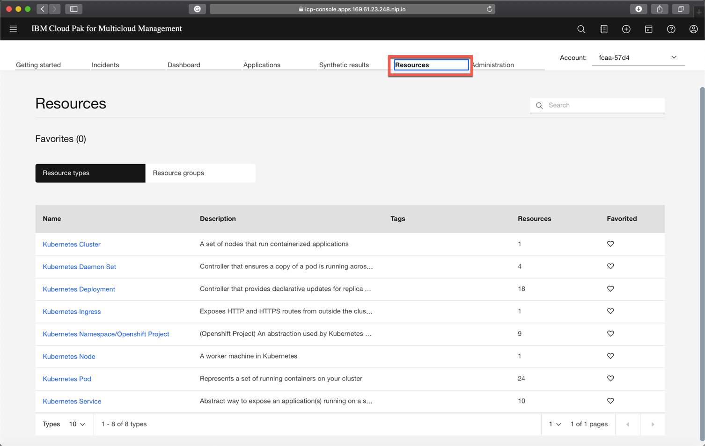
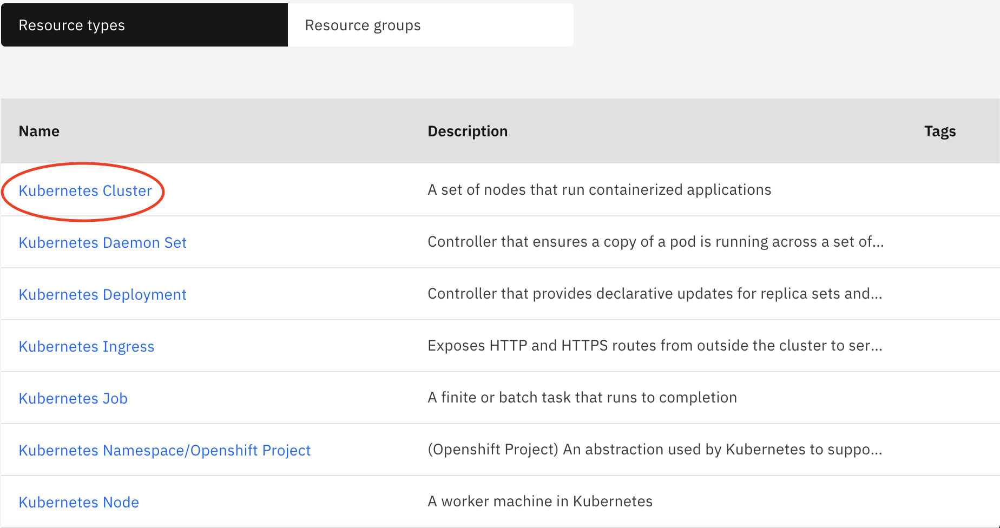
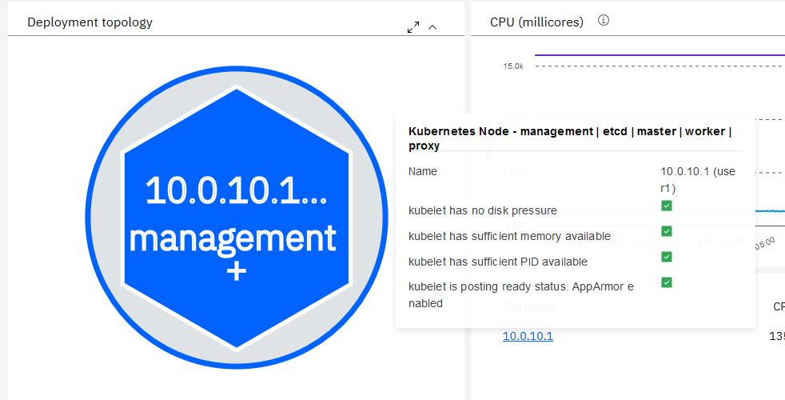
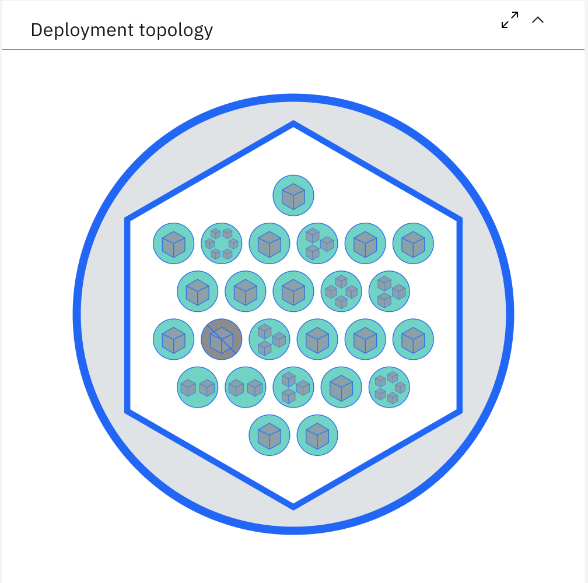
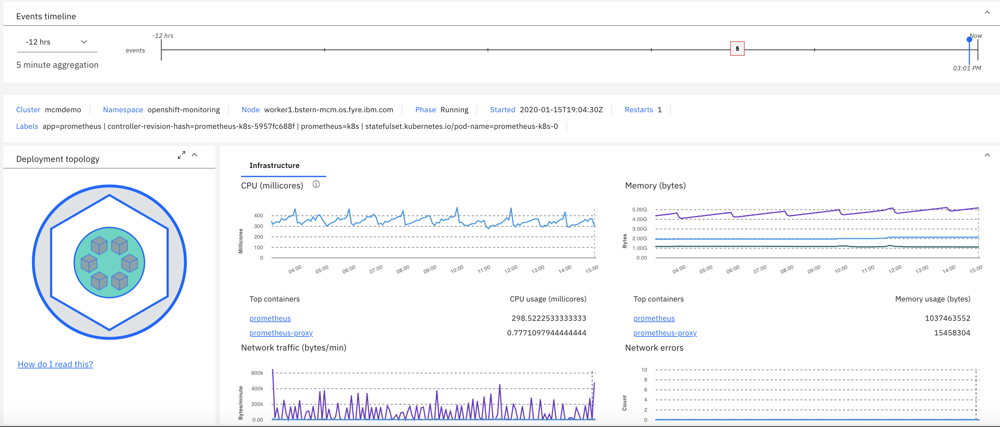
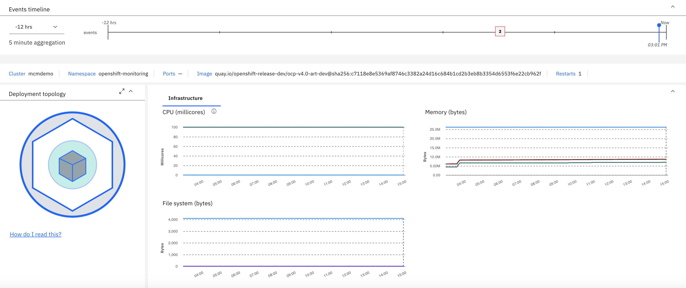

# Exploring Kubernetes Resources and Dashboards

[Go back to the Table of Contents](../../README.md)

## Exploring the Resources Page

### 1. In the browser with the IBM Cloud App Management UI, click the **Resources** tab

Once in Resources, you will see two tabs at the top labeled “Resource types", which is selected by default and "Resource groups”.  Below the tabs you’ll see a list of all the currently monitored resources in your environment, such as Kubernetes pods, nodes, clusters, etc.

At the top right of the screen you will notice a “Search” box as well as the ability to “Sort” the list of Resources by selecting any of the column headings.  Let’s try out the sort capability.  Click the “Name” column heading to sort the Resources alphabetically.  Clicking it again will sort them in reverse order.

Let’s look at the Kubernetes resources.  Like we did in the last exercise, click on “Kubernetes Cluster” and you will see a list showing a single Kubernetes Cluster.

Within the list, click on the link with the name of your cluster that you used when you imported it.  You will see a page showing information about the kubernetes cluster.

The most important element is the widget on the left side showing the topology of the kubernetes environment.

In your lab environment, the cluster is very simple.  Your managed cluster contains a single node.

The large circle represents the cluster.  Each of the hexagons represents one of the nodes in the cluster.  Click on any of the objects and drill into more details.  For example, click on the hexagon that is labeled master and you will see a large circle (the cluster), a single hexagon (the node), and a large number of small circles that represent the pods.

Within each pod, you’ll see one or more hexagons that represents the containers running within the pod.   On the page, you will also see performance KPIs related to the Node.  Spend a minute exploring the page and see the Node metrics.

You may notice that some of the pods or containers are yellow, red or gray.  This indicates that there are issues with those.

You can flyover any of the objects in the topology and you will see a pop-up with status related information.  Try flying over some of the pods and containers. If any are gray, yellow or red, focus on those.

If you move the time slider at the top of the screen to a different point in time, the topology will reflect the state and topology of kubernetes at that time.

If you click on a pod or a container, you will drill into more details on the selected object.  Click on one of the pods to drill into the details.

You will see detailed performance KPIs and properties related to the pod.  You’ll also see the Cluster and Node where the pod is running and the containers that make up the pod.   You can click on any of the objects in the topology to either drill down into a container or to get a higher level view of the Node or the Cluster.

Click on one of the containers to drill down into the container level details.

So far, we have explored kubernetes infrastructure metrics. Using Site Reliability Engineering (SRE) principals to manage applications requires deeper analysis. In kubernetes, infrastructure like pods and containers can have a high churn rate, but the services they implement have longer lifespans. The SRE really needs to know the health of the service, but the kubernetes APIs do not provide any health data for abstractions like services. ICAM can help bridge the gap by providing a bridge between the services that SREs care about and the infrastructure that implements them.

This concludes the exercise.

[Go back to the Table of Contents](../../README.md)

<table>
  <tr>
    <td>Version</td>
    <td>1.0</td>
  </tr>
  <tr>
    <td>Author</td>
    <td>Sean Lombardo, IBM</td>
  </tr>
  <tr>
    <td>email</td>
    <td>sean.lombardo@ibm.com</td>
  </tr>
</table>
